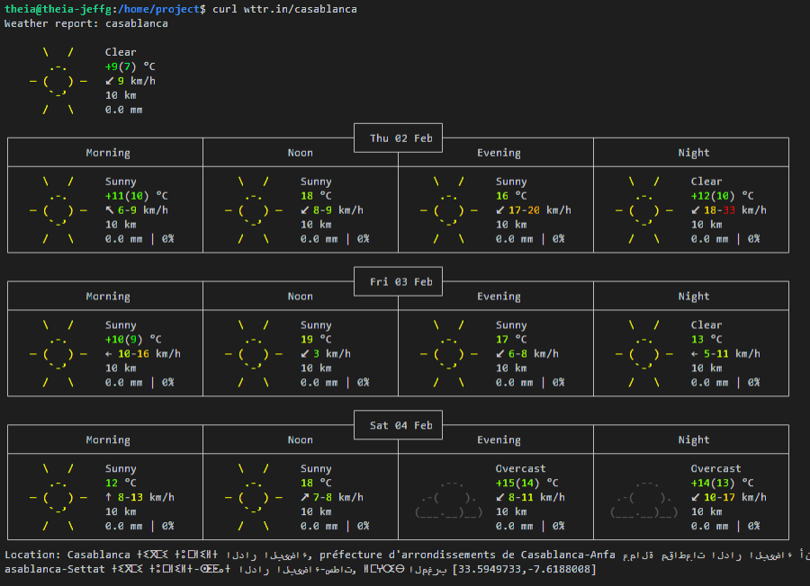

+
-
Practice Project: Introduction
Scenario
You've been tasked by your team to create an automated Extract, Transform, Load (ETL) process to extract daily weather forecast and observed weather data and load it into a live report to be used for further analysis by the analytics team. As part of a larger prediction modelling project, the team wants to use the report to monitor and measure the historical accuracy of temperature forecasts by source and station.

As a proof-of-concept (POC), you are only required to do this for a single station and one source to begin with. For each day at noon (local time), you will gather both the actual temperature and the temperature forecasted for noon on the following day for Casablanca, Morocco.

At a later stage, the team anticipates extending the report to include lists of locations, different forecasting sources, different update frequencies, and other weather metrics such as wind speed and direction, precipitation, and visibility.

Data source
For this practice project, you'll use the weather data package provided by the open source project wttr.in, a web service that provides weather forecast information in a simple and text-based format. For further information, you can read more about the service on its GitHub Repo.

First, you'll use the curl command to scrape weather data via the wttr.in website. For example, to get data for Casablanca, enter:

1
curl wttr.in/casablanca
Copied!
which prints the following to stdout:

Learning Objectives
After completing this practice project, you will be able to apply your new shell scripting skills in a real-world scenario to:

Download raw weather data
Extract data of interest from the raw data
Transform the data as required
Load the data into a log file using a tabular format
Schedule the entire process to run automatically at a set time daily
Overview
Weather reporting tasks
You must extract and store the following data every day at noon, local time, for Casablanca, Morocco:

The actual temperature (in degrees Celsius)
The forecasted temperature (in degrees Celsius) for the following day at noon
Here is an example of what the the resulting weather report should look like:

year	month	day	obs_tmp	fc_temp
2023	1	1	10	11
2023	1	2	11	12
2023	1	3	12	10
2023	1	4	13	13
2023	1	5	10	9
2023	1	6	11	10
…	…	…	…	…
Table 1. Example of weather report

Feel free to try completing the entire project on your own, or follow the exercises below to guide you through the process. Either way, check out the exercises, hints, and solutions.

Tip: At each step of the process, test your code to ensure it does what you intended. For more complicated steps, break the task down into smaller, more managable steps that you can test individually. You can test code on the command line or by running your script as you develop it. The context will indicate the best approach.

Authors
Jeff Grossman

Other Contributors
Rav Ahuja

--- Last part of project
Exercise 3 - Schedule your bash script rx_poc.sh to run every day at noon local time
3.1. Determine what time of day to run your script
Recall that you want to load the weather data coresponding to noon, local time in Casablanca, every day.
Check the time difference between your system’s default time zone and UTC.

Click here for Hint 1
Use the date command twice with appropriate options.

Click here for Hint 2
Running the following commands gives you the info you need to get the time difference between your system and UTC.

1
2
3
4
$ date
Mon Feb 13 11:28:12 EST 2023
$ date -u
Mon Feb 13 16:28:16 UTC 2023
Copied!
Now you can determine how many hours difference there are between your system’s local time and that of Casablanca.

Click here for Solution
From the example above, we see that the system time relative to UTC is UTC+5 (i.e., 16 - 11 = 5).
We know Casablanca is UTC+1, so the system time relative to Casablanca is 4 hours earlier. Thus, to run your script at noon Casablanca time, you need to run it at 8 am.

3.2 Create a cron job that runs your script
Click here for Hint
Click here for Solution
Edit the crontab file

1
crontab -e
Copied!
Add the following line at the end of the file:

1
0 8 * * * /home/project/rx_poc.sh
Copied!
Save the file and quit the editor.